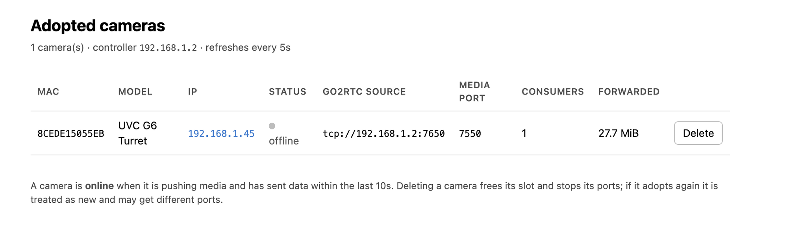

# unifi-controller

A minimal, stdlib-only Python mock UniFi Protect controller for adopting a
standalone UniFi camera (tested against a UVC G6 Turret) **without** an
actual UniFi Protect NVR/console, and re-serving its video as clean FLV for
direct consumption by go2rtc/Frigate — no ffmpeg, no mediamtx, no RTSP
relay in between.

## Why this exists

UniFi cameras normally only stream to a UniFi Protect controller: they
authenticate over a TLS+WebSocket "inform" channel, get adopted, then push
their video/audio over a second plain-TCP connection using a
UniFi-proprietary variant of FLV ("extendedFlv" — regular FLV tags with an
extra 16-byte timing trailer appended after each one). This project
re-implements just enough of that protocol to:

1. Accept the camera's TLS/WebSocket control connection and complete
   adoption (hello / arm / authToken handshake).
2. Tell the camera to push its media stream to *this* host, on a port
   reserved for that specific camera.
3. Accept that raw extendedFlv push, strip the non-standard trailer/tag
   types, and re-broadcast it as genuine FLV.
4. Serve that clean FLV stream on a plain TCP port that go2rtc (or
   anything else that understands FLV) can pull directly via
   `tcp://<host>:<port>`.
5. Show which cameras are adopted, whether each is currently streaming,
   and which port to point go2rtc at — over a small web interface, which
   also lets you delete cameras you no longer use.

## Architecture

```
UniFi camera                     this container                    go2rtc / Frigate
------------                     ---------------                    -----------------
TLS+WS "inform"  ───────────►  :18080  control/adoption logic
                                (hello, paramAgreement/authToken,
                                 timeSync, arm, ChangeDeviceSettings,
                                 LED off, ...)

raw TCP extendedFlv  ────────►  :7550+n  strip 16-byte trailer,
                                drop non-standard tag types,
                                recompute PreviousTagSize,
                                rebase timestamps,
                                cache codec config tags
                                        │
                                        ▼
                                 in-memory broadcaster (one per camera)
                                        │
                                        ▼
                                clean FLV byte stream ──────────►  :7650+n  pulled via
                                                                   tcp://<host>:7650+n

browser  ───────────────────►  :18081  status web interface
                                (adopted cameras, online/offline,
                                 go2rtc port, delete)
```

Each adopted camera gets its **own pair of ports** (`n` is that camera's
registry index), so any number of cameras can stream at once. See
[Multiple cameras](#multiple-cameras).

### Control channel (port 18080, TLS + WebSocket)

The camera connects here first (`GET /camera/1.0/ws`) to perform its
"inform" handshake. This process:
- Terminates TLS (self-signed cert, generated on first start — see
  [TLS certificate](#tls-certificate) below).
- Completes the WebSocket upgrade.
- Implements just enough of the JSON message protocol to satisfy the
  camera's adoption flow and tell it where to push media
  (`CONTROLLER_HOST:<that camera's media port>`). Inbound it handles
  `ubnt_avclient_hello`, `ubnt_avclient_paramAgreement` (which carries the
  camera's `authToken`) and `ubnt_avclient_timeSync`; outbound it sends the
  hello reply, `paramAgreement`, `ChangeVideoSettings` (the "arm" message),
  `ChangeDeviceSettings` and `ChangeSoundLedSettings`.
- Sends `ChangeDeviceSettings` shortly after adoption to set the camera's
  timezone (see [Setting the camera's timezone](#setting-the-cameras-timezone)),
  and `ChangeSoundLedSettings` to turn off its status LED.

### Media ingest (ports 7550+n, plain TCP)

Once adopted, the camera opens a second, unencrypted TCP connection here
and pushes its video/audio as "extendedFlv": standard FLV tags, each
followed by an extra 16-byte UniFi-specific timing trailer, plus an
occasional non-standard tag type the camera emits that a normal FLV
demuxer can't parse. This process:
- Strips the 16-byte trailer.
- Drops non-standard tag types (keeping only audio/video/script tags).
- Recomputes each tag's `PreviousTagSize` field (since dropped tags would
  otherwise break the chain).
- Rebases tag timestamps onto a continuous per-camera output clock. The
  camera's FLV timestamps are uptime-based and its timeline can restart
  near zero — both when it reconnects *and* mid-push, with every track
  jumping together. Forwarding a restart verbatim makes DTS jump backwards
  for anything already consuming the stream (ffmpeg: `Non-monotonic DTS`).
  A restart is only believed once a second tag confirms the new timeline,
  and then the whole stream re-anchors on one shared offset so A/V sync is
  preserved. Individual tags that carry a *different* clock — the camera's
  device uptime (days) rather than its session time — are pinned to the
  current output position and logged, because a single one of them would
  otherwise drag the output clock days into the future with no way back.
  As a backstop, the timestamp emitted for a given tag type can never move
  backwards.
- Serves only one push per camera at a time: a new media connection retires
  the previous one, so two overlapping pushes can't interleave two
  independent timelines into the same output.
- Sends the FLV header only to consumers that don't already have one — a
  camera reconnect must not splice a second `FLV` signature into a
  mid-stream consumer's byte stream.
- Caches the one-time codec config tags — the AMF `onMetaData` tag, the
  AVC sequence header, and the AAC sequence header — since the camera only
  sends these once near the start of the stream. Without replaying them to
  new consumers, downstream demuxers (like go2rtc) can connect fine but
  detect zero media tracks.
- Broadcasts the resulting clean FLV byte stream to every consumer
  connected to *that camera's* FLV output port.
- Starts each consumer at a video keyframe. A consumer handed the middle of
  a GOP gets inter-frames it can't decode, so go2rtc/ffmpeg produces nothing
  and Frigate's watchdog restarts it — an endless reconnect loop, with a
  fresh timeline (and a `Non-monotonic DTS` complaint) every time.
- Serializes all writes to a consumer socket. The join payload (header +
  config tags) is written from the accept thread while the media thread is
  broadcasting live tags; without a per-consumer lock those two writes can
  interleave and corrupt the byte stream.

### FLV output (ports 7650+n, plain TCP)

Any client connecting here becomes a broadcast consumer: it immediately
receives the cached FLV header + cached codec config tags, then joins the
live tag stream at the next video keyframe.

Point go2rtc at it with a plain `tcp://` stream source (no query strings or
ffmpeg needed):

```yaml
streams:
  cam_yard: tcp://<this-host>:7650
```

If Frigate logs `Non-monotonic DTS` and restarts ffmpeg on a loop, see
[Troubleshooting a restart loop](#troubleshooting-a-restart-loop).

## Web interface (port 18081)

A small status and management page is served on `http://<this-host>:18081`.



It lists every adopted camera with:

- its **MAC address** (the registry key) and reported model,
- its **IP address**, linked to the camera's own web UI,
- whether it is **online** (currently pushing media) or **offline**,
- the **`tcp://` source to paste into go2rtc**, plus the media ingest port,
- how many consumers are attached and how much clean FLV has been forwarded,
- a **Delete** button for cameras that are no longer in use.

The page refreshes itself every 5 seconds. The same data is available as
JSON at `/api/cameras` if you'd rather script against it, and `/healthz`
returns `ok` for container health checks.

"Online" means the camera has an open media connection **and** has sent data
within the last `STREAM_IDLE_TIMEOUT` seconds (default 10). The extra
condition matters because a camera that loses power or network can leave a
half-open TCP connection behind, which would otherwise look like a live
stream indefinitely.

The IP shown is the address the camera last connected to the control channel
from, so it appears once a camera has adopted at least once and is remembered
across restarts. It links to `https://<ip>/`, the camera's own web UI — which
uses a self-signed certificate, so your browser will warn on first visit.

### Deleting a camera

Deleting removes the camera from the registry and the state file, closes its
listeners and drops any live media/consumer connections, so its ports are
released immediately. Its index becomes free, so the **next** camera to adopt
may reuse those ports — remember to update your go2rtc config. If the deleted
camera adopts again later it is treated as brand new and may be assigned
different ports.

The page is unauthenticated, like the rest of this project, so keep it on a
trusted network. Set `WEB_HOST=127.0.0.1` to bind it to loopback only.

## Multiple cameras

Any number of cameras can be adopted and streamed concurrently. Each one
gets its **own media-in and FLV-out port pair**, because FLV is a single
continuous muxed byte stream — two cameras writing into one port would
interleave their tags into unrecoverable garbage.

Cameras are keyed by **MAC address**, read from the camera's
`ubnt_avclient_hello` at adoption time. A registry maps MAC → index and
persists it to `STATE_FILE`, and the ports are derived as:

```
media port = MEDIA_PORT_BASE + index   (default 7550, 7551, 7552, ...)
flv port   = FLV_PORT_BASE   + index   (default 7650, 7651, 7652, ...)
```

Because the port a camera is told to dial is unique to it, the destination
port *is* the camera's identity — there is no source-IP guessing and no race
when two cameras adopt at the same time. The assignment is persisted, so a
camera keeps the same ports across restarts (important, since your go2rtc
config references them by number). Listeners for all known cameras are
started eagerly at boot, so go2rtc can reconnect before the camera
re-adopts.

### Finding a camera's FLV port

The easiest way is the [web interface](#web-interface-port-18081), which
shows the ready-to-paste go2rtc source for each camera. Both the registry
allocation and each adoption also log the mapping to stdout:

```
=== allocated camera 8CEDE15055EB index=0 media=7550 flv=7650 ===
=== camera 8CEDE15055EB (UVC G6 Turret) => media tcp://192.168.1.2:7550, flv tcp://0.0.0.0:7650 ===
```

You can also read `STATE_FILE` directly — it is a JSON map of
`{"<MAC>": {"index": n, "name": "...", "last_seen": "...", "ip": "..."}}`.
The original flat `{"<MAC>": n}` format is still read, so an existing state
file keeps working.

### go2rtc with several cameras

```yaml
streams:
  cam_yard: tcp://<this-host>:7650      # 8CEDE15055EB, index 0
  cam_door: tcp://<this-host>:7651      # 8CEDE15055FF, index 1
  cam_shed: tcp://<this-host>:7652      # index 2
```

### Troubleshooting a restart loop

If Frigate logs `Non-monotonic DTS` followed by `watchdog … Restarting
ffmpeg`, work through these in order — the first two are by far the most
common causes and neither is a timestamp problem:

1. **Match `detect.fps` to the stream.** These cameras push 30 fps. Frigate
   kills ffmpeg once measured frame rate reaches `detect.fps + 10`, and
   `detect.fps` defaults to 5 — a guaranteed restart every ~50 s regardless
   of timestamps, and every restart re-anchors DTS. Either set `fps: 30`
   under `detect:`, or downsample in the output args:
   `-r 5` in `ffmpeg.output_args.detect`.

2. **Restart Frigate after deploying this container.** Our output clock
   restarts near zero on container start, so any Frigate ffmpeg session that
   survives the deploy sees a large backwards jump. Errors in the first
   minutes after a `docker compose up -d` are expected and mean nothing.

3. **Measure with `-fps_mode passthrough`.** `-f null` decodes and re-emits
   through `wrapped_avframe`, whose timebase comes from a *guessed* frame
   rate. Against a 30 fps stream it quantises onto a coarser grid, which
   invents both dropped frames and `non monotonically increasing dts to
   muxer` warnings that do not exist in the stream:

   ```
   ffmpeg -rtsp_transport tcp -i rtsp://127.0.0.1:8554/cam_yard \
       -t 20 -map 0:v -fps_mode passthrough -f null -
   ```

   Compare that against reading this container's port directly
   (`-i tcp://<this-host>:7650`) to tell our output apart from the rest of
   the chain.

4. **As a fallback, hand parsing to ffmpeg** instead of go2rtc's own FLV
   producer. Nothing is re-encoded — this is still a straight remux:

   ```yaml
   streams:
     cam_yard: ffmpeg:tcp://<this-host>:7650#video=copy#audio=copy
   ```

### Audio and video are one stream, not two

Audio and video are **not** separate streams needing separate ports. They
are interleaved FLV tag types 8 (audio) and 9 (video) inside a single muxed
stream, so one port per camera carries both. Splitting them would require a
real demuxer, and go2rtc expects them muxed anyway — hence "one port per
camera", not "one port per track".

Note that each camera is armed at up to 6 Mbit/s VBR, so total ingest
bandwidth scales linearly with the number of cameras.

## Configuration (environment variables)

| Variable          | Default                          | Description                                                              |
|-------------------|-----------------------------------|---------------------------------------------------------------------------|
| `CONTROLLER_HOST` | *(required)*                      | Address the camera can resolve/reach — this host's LAN IP, or a hostname if the camera has working DNS. Told to the camera as its media-push destination. `CONTROLLER_IP` is accepted as a deprecated alias. |
| `LISTEN_HOST`     | `0.0.0.0`                          | Bind address for the TLS/WebSocket control channel.                       |
| `LISTEN_PORT`     | `18080`                            | Port for the TLS/WebSocket control channel.                               |
| `MEDIA_HOST`      | `0.0.0.0`                          | Bind address for the extendedFlv media ingest.                            |
| `MEDIA_PORT_BASE` | `7550`                             | First port of the per-camera extendedFlv ingest range. `MEDIA_PORT` is accepted as a deprecated alias. |
| `FLV_HOST`        | `0.0.0.0`                          | Bind address for the clean-FLV consumer output.                           |
| `FLV_PORT_BASE`   | `7650`                             | First port of the per-camera clean-FLV output range (point go2rtc here). `FLV_PORT` is accepted as a deprecated alias. |
| `STATE_FILE`      | `cameras.json` next to the script  | Persisted MAC → index map that keeps each camera's ports stable across restarts. Under Docker this **must** point into the mounted volume (`docker-compose.yml` sets `/data/cameras.json`), or it is lost whenever the container is recreated. |
| `WEB_HOST`        | `0.0.0.0`                          | Bind address for the status web interface. Set to `127.0.0.1` to keep it off the LAN. |
| `WEB_PORT`        | `18081`                            | Port for the status web interface.                                        |
| `STREAM_IDLE_TIMEOUT` | `10`                           | Seconds without forwarded data after which a camera is shown as offline, even if its TCP connection is still open. |
| `DEVICE_TIMEZONE` | `Europe/Copenhagen`                | IANA zone name pushed to the camera in `ChangeDeviceSettings` at adoption, so its clock and OSD show local time instead of UTC. Must be an IANA name, not a POSIX TZ string — see [Setting the camera's timezone](#setting-the-cameras-timezone). |
| `CERT_DIR`        | directory containing the script    | Directory to read/write `cert.pem`/`key.pem`.                             |
| `CERT_CN`         | `unifi-controller`                 | Common Name for the self-signed cert `entrypoint.sh` generates. Only used when no cert exists yet. |

The two port bases are spaced far apart so the ranges cannot collide as the
camera count grows. If you override them, keep that gap wider than your
expected number of cameras.

Logs go to the container's standard streams: informational output on
stdout, errors on stderr. Use `docker logs` (or your log driver) to read
them — there is no log file.

At startup the container validates that `CONTROLLER_HOST` resolves *from
inside the container* (`socket.getaddrinfo`) and refuses to start if it
doesn't. This is a sanity check only — the camera does its own DNS
resolution independently, so a hostname must also resolve from the
camera's network. Most UniFi cameras sit on an isolated LAN/VLAN without
a working resolver, so a plain LAN IP is usually the safer choice; only
use a hostname if you know the camera can resolve it.

## TLS certificate

The camera doesn't appear to validate the control channel's TLS
certificate against a CA, so any valid self-signed cert works. On first
container start, `entrypoint.sh` generates a self-signed cert/key into
`CERT_DIR` (default `/certs`) if one isn't already present there. Mount a
volume at `/certs` (see `docker-compose.yml`) to persist it across
restarts.

## Running

### Docker Compose

```bash
# edit CONTROLLER_HOST in docker-compose.yml to this host's LAN IP (or a
# hostname the camera can resolve) first
docker compose up -d --build
```

Then open `http://<this-host>:18081` to see adopted cameras and their
go2rtc ports.

`network_mode: host` is used deliberately: the camera initiates both the
control connection and the raw media push directly to this host's IP, and
go2rtc/Frigate typically pull the FLV output from the same host — bridge
networking would need extra NAT/hairpin configuration for the
camera-initiated connections. It also means the per-camera port ranges
(`7550+` and `7650+`) need no explicit publishing; on bridge networking you
would have to publish both ranges yourself.

A named volume is mounted at `/data` to persist `cameras.json`, the MAC →
port-index map. Remove it and cameras will be re-indexed on next adoption,
which can change their FLV ports.

### Camera adoption

Point the camera at this controller the same way you would a real UniFi
Protect console/inform URL (adjust to your adoption tooling), e.g.:

```
ubnt_ipc_cli -T=ubnt_avclient -r=1 -x='response/statusCode' \
  -m='{"functionName":"Adopt","hosts":["<this-host>:18080/inform"],"protocol":"wss"}'
```

The host entry carries no `https://` scheme — the transport is set by
`"protocol":"wss"` instead, and including a scheme makes the camera fail to
parse the destination.

### Setting the camera's timezone

The camera's clock defaults to UTC. This controller sets it automatically at
adoption by sending `ChangeDeviceSettings` with the `DEVICE_TIMEZONE` value —
no shell access on the camera is needed, and the setting survives reboots.

The value **must be an IANA/Olson zone name**, e.g. `Europe/Copenhagen`:

```yaml
environment:
  - DEVICE_TIMEZONE=Europe/Copenhagen
```

A **POSIX TZ string like `CET-1CEST,M3.5.0,M10.5.0/3` does not work** — the
firmware splits it on `/` and looks for a zone literally named `3`, logging:

```
ctl[1545]: Not found relevant timezone 3 [ubnt_ctlserver:CtlServer.cpp:updateSettings:634]
```

The zone must also exist in the camera's own `/usr/share/zoneinfo`, which
carries the standard IANA tree (`Europe/Copenhagen`, `America/New_York`, …).

#### What the camera does with it

On receiving the message, the camera's `ubnt_ctlserver`:

1. resolves the name under `/usr/share/zoneinfo`,
2. points `/etc/localtime` at it,
3. writes `system.timezone` into `/etc/persistent/system.cfg`, and
4. derives the regional mains frequency for anti-flicker
   (`SetAutoAeModeByTimezone` — 50 Hz for Europe, 60 Hz for North America).

`/etc` is tmpfs, so the symlink itself does not survive a reboot — but the
camera recreates it from its persistent config on every boot. Sending the
message once at adoption is enough.

#### Verifying

Over SSH on the camera:

```sh
date                                     # should show local time, e.g. CEST
ls -l /etc/localtime                     # -> /usr/share/zoneinfo/Europe/Copenhagen
grep timezone /etc/persistent/system.cfg # system.timezone=Europe/Copenhagen
```

Long-running processes cache the zone at startup, so a camera that was
already streaming may keep rendering UTC on its overlay until it restarts.
A reboot — or the camera's normal re-adoption cycle — clears this.

## Known limitations

- `ChangeSoundLedSettings` is implemented as a best-effort controller→
  camera setter based on `unifi-cam-proxy`'s protocol implementation, but
  has not been exhaustively verified across camera models/firmware.
- Only tested against a single UVC G6 Turret. Other UniFi camera models
  may use a different adoption handshake or FLV tag layout.
- A camera whose `ubnt_avclient_hello` carries no usable MAC address cannot
  be assigned ports and will not be armed; the failure is logged to stderr
  rather than falling back to a shared port.
